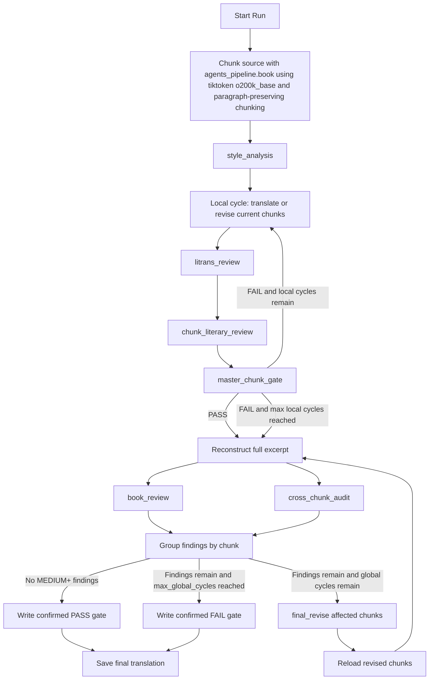

# Agentic MT Pipeline

This directory contains the agentic literary-MT pipeline used to translate a source excerpt into a configurable target language with iterative chunk-level and excerpt-level review.

Public-release note: this pipeline is included for reproducibility, but source
texts are withheld from GitHub. Full reruns require controlled-access source
files requested from the authors or, later, the gated Hugging Face dataset.

## Overview

The pipeline currently has two nested loops:

- a **local chunk loop** that improves individual chunks
- a **global excerpt loop** that improves the reconstructed excerpt as a whole

At a high level, the flow is:

## Chunking

The agentic pipeline uses `agents_pipeline/book.py`, not the root-level `book.py`.

Chunking is:

- token-based via `tiktoken`
- encoding: `o200k_base`
- paragraph-preserving
- target limit: `1000` tokens per chunk

The chunker works as follows:

1. Split the source excerpt into paragraphs using blank lines.
2. Keep adding whole paragraphs to the current chunk while the chunk stays within the token limit.
3. If the next paragraph would push the chunk above the limit, close the current chunk and start a new one.
4. If a single paragraph is itself larger than the limit, keep that paragraph intact as its own oversized chunk. Paragraphs are not split.

If the input file already contains `<chunk>...</chunk>` tags, those chunks are used directly.

## Current defaults

- `max_cycles = 3`
- `max_global_cycles = 2`

This means:

- up to `3` local chunk-level cycles
- up to `2` global excerpt-level cycles

## Current provider mapping

The current provider/model mapping is defined in `agents_pipeline/config.json`.

| Stage | Provider | Model | Purpose |
| --- | --- | --- | --- |
| `style_analysis` | `claude` | `claude-opus-4-6` | full-source style bible generation |
| `translate` | `claude` | `claude-opus-4-6` | first-pass chunk translation |
| `litrans_review` | `codex` | `gpt-5-codex` | chunk-level QE / source-faithfulness review |
| `chunk_literary_review` | `claude` | `claude-opus-4-6` | chunk-level literary review |
| `revise` | `claude` | `claude-opus-4-6` | chunk-level revision of local failures |
| `book_review` | `codex` | `gpt-5-codex` | excerpt-level literary / global translation review |
| `cross_chunk_audit` | `codex` | `gpt-5-codex` | cross-chunk seam and consistency audit |
| `final_revise` | `claude` | `claude-opus-4-6` | chunk-targeted final revision with full-excerpt context |

This is configurable per stage via `agents_pipeline/config.json`; the table above describes the current checked-in configuration, not a hard requirement.

## Target Language

The target language is selected with `--target_lang` and defaults to `en`.

Supported target language codes:

- `en` -> English
- `fr` -> French
- `ja` -> Japanese
- `pl` -> Polish

The source language is still inferred from the source filename suffix. The target language controls prompt wording and output filenames.

## Relation to Autofiction

This split is broadly similar in spirit to the provider pattern described in Autofiction's public README, though not identical in stage names or responsibilities.

Autofiction's README describes a recommended configuration roughly like this:

| Autofiction stage | Provider preference in README |
| --- | --- |
| outline / chapter drafting | `Claude Code` |
| chapter review | `Codex` |
| full-book review | `Claude Code` |
| cross-chapter audit | `Claude Code` |
| structural / prose revision | `Codex` |
| dialogue revision | `Claude Code` |

Compared with that:

- this MT pipeline currently uses `Claude` for generation-style stages (`style_analysis`, `translate`, `revise`, `final_revise`) and for chunk-level literary judgment (`chunk_literary_review`)
- it uses `Codex` for more structured review/audit stages (`litrans_review`, `book_review`, `cross_chunk_audit`)
- this gives the local review pair a deliberate split:
  - `litrans_review` on `Codex` for structured QE-style checking
  - `chunk_literary_review` on `Claude` for literary/voice-sensitive judgment
- unlike Autofiction's recommended split, `book_review` and `cross_chunk_audit` are currently assigned to `Codex`, not `Claude`

So the overall idea is similar: one provider is doing more of the generation/revision work, while the other is doing more of the explicit review/audit work. The exact stage assignments remain configurable and can be changed as evaluation preferences evolve.

## Stage-by-stage flow

### 1. `style_analysis`

Prompt:
- `prompts/style_analysis.txt`

Runs once at the beginning.

Reads:
- the full source excerpt

Writes:
- `outputs/style_bible.json`

This style bible is used throughout the rest of the pipeline for:
- voice
- register
- named entities
- terminology
- prose-style guidance

### 2. Local chunk loop

The local loop improves chunk-level quality.

#### Local cycle 1

For every chunk:

1. `translate`
   - Prompt: `prompts/translate.txt`
   - Uses the current source chunk, style bible, and adjacent source context
   - Writes `outputs/segment_translation_####.json`

2. `litrans_review`
   - Prompt: `prompts/litrans_review.txt`
   - Uses the current source chunk, current translation, and adjacent source/translation context
   - Agent writes `outputs/litrans_answers_####.json`
   - Code validates the output and writes `outputs/litrans_review_####.json`

3. `chunk_literary_review`
   - Prompt: `prompts/chunk_literary_review.txt`
   - Uses the current source chunk, current translation, style bible, and adjacent source/translation context
   - Writes `outputs/chunk_literary_review_####.json`

4. `master_chunk_gate`
   - Combines QE failures and literary-review failures

If all chunks pass, the local loop ends.

If some chunks fail, only those chunks move to the next local cycle.

#### Local cycles 2..`max_cycles`

For failing chunks only:

1. `revise`
   - Prompt: `prompts/revise.txt`
   - Uses source chunk, current translation, QE details, chunk literary findings, style bible, and adjacent context
   - Rewrites `outputs/segment_translation_####.json`

2. Rerun:
   - `litrans_review`
   - `chunk_literary_review`
   - `master_chunk_gate`

This repeats until:

- local pass, or
- `max_cycles` is reached

If `max_cycles` is reached and some chunks still fail, the pipeline warns and continues to the global stage with the best available chunk translations.

## QE rule

`litrans_review` still reports a numeric score in `[0, 1]`, but pass/fail is no longer based on the score threshold alone.

Current pass rule:

- `NO count` must be `0`
- `MAYBE count` must be `<= 5`

The QE report stores:

- `score`
- `verdict`
- `decision_rule`
- `yes_count`
- `maybe_count`
- `no_count`
- `failed_question_ids`
- `failed_questions`

### 3. Reconstruct full excerpt

After local chunk processing finishes, the pipeline reconstructs the current full translated excerpt.

Writes:
- `{book_name}_{target_lang}_draft.txt`

### 4. Global excerpt loop

The global loop improves excerpt-level quality.

Each global cycle starts by reconstructing the full excerpt again from the current chunk translations.

Then two global review stages run in parallel:

#### `book_review`

Prompt:
- `prompts/book_review.txt`

Purpose:
- excerpt-level literary and global translation issues

Focuses on:
- repeated translationese across the excerpt
- flattening visible only at the excerpt level
- broader literary/translational weakening

Writes:
- `outputs/book_review.json`

#### `cross_chunk_audit`

Prompt:
- `prompts/cross_chunk_audit.txt`

Purpose:
- seam quality and cross-chunk consistency

Focuses on:
- term inconsistency
- narrator/register drift across chunks
- tense or POV drift across chunk boundaries
- seam problems
- cross-chunk inconsistency patterns

Writes:
- `outputs/cross_chunk_audit.json`

### 5. Group findings by chunk

The outputs of `book_review` and `cross_chunk_audit` are parsed and grouped by chunk ID into:

- `book_review_findings`
- `cross_chunk_audit_findings`

This grouped structure is passed into final revision so the reviser can distinguish excerpt-level literary problems from seam/consistency problems.

### 6. `final_revise`

Prompt:
- `prompts/final_revise.txt`

Runs only on affected chunks.

Uses:
- full source excerpt (read-only global context)
- full reconstructed excerpt draft (read-only global context)
- current source chunk
- current translation
- grouped excerpt-level findings
- style bible

Writes:
- updated `outputs/segment_translation_####.json`
- `outputs/final_revise_####.json`

After `final_revise`, translations are reloaded and the global review cycle runs again.

### 7. Final stop conditions

If there are no `MEDIUM+` findings in the global cycle:

- write a confirmed final `PASS` gate
- save `{book_name}_{target_lang}.txt`
- stop

If findings remain and global cycles are still available:

- run `final_revise`
- reload chunks
- rerun the global cycle

If findings remain and `max_global_cycles` is exhausted:

- write a confirmed final `FAIL` gate
- save the best available `{book_name}_{target_lang}.txt`
- stop

## What repeats

Runs once:

- `style_analysis`

Repeats in the local loop:

- `translate` only in local cycle 1
- `revise` in later local cycles
- `litrans_review`
- `chunk_literary_review`
- `master_chunk_gate`

Repeats in the global loop:

- reconstruct excerpt
- `book_review`
- `cross_chunk_audit`
- `final_revise` if findings remain

## Boundary context

Chunk-level stages use adjacent context with explicit first/last-chunk fallbacks.

These stages currently use boundary context:

- `translate`
- `litrans_review`
- `chunk_literary_review`
- `revise`

First and last chunk edge cases are handled with explicit marker strings such as:

- `None. This is the first chunk.`
- `None. This is the last chunk.`
- `Unavailable during the initial translation pass.`

The prompts explicitly say this context is for continuity/seam/local-register awareness only and must not be used to rewrite neighboring chunks from a chunk-local stage.

Current boundary extraction is intentionally simple and not perfect:

- neighboring context is selected as **full paragraphs** from the previous/next chunk
- selection uses an approximate token budget of about `200` tokens per side
- if the first selected paragraph alone exceeds that budget, it is still kept intact
- the extractor is **not sentence-aware**, so if a paragraph itself contains multiple sentences, the context window is still paragraph-based rather than sentence-based

This is an accepted tradeoff in the current pipeline: the local stages get lightweight boundary awareness, while the stronger global safeguards (`book_review`, `cross_chunk_audit`, and excerpt-aware `final_revise`) are responsible for catching problems that survive imperfect local context slicing.

For `final_revise`, the strongest context bundle is used instead:

- full source excerpt via `inputs/full_source.txt`
- full reconstructed excerpt draft via `{book_name}_{target_lang}_draft.txt`
- current chunk source
- current chunk translation
- grouped findings
- style bible

`final_revise` is still chunk-targeted, but it is excerpt-aware at the final stage.
