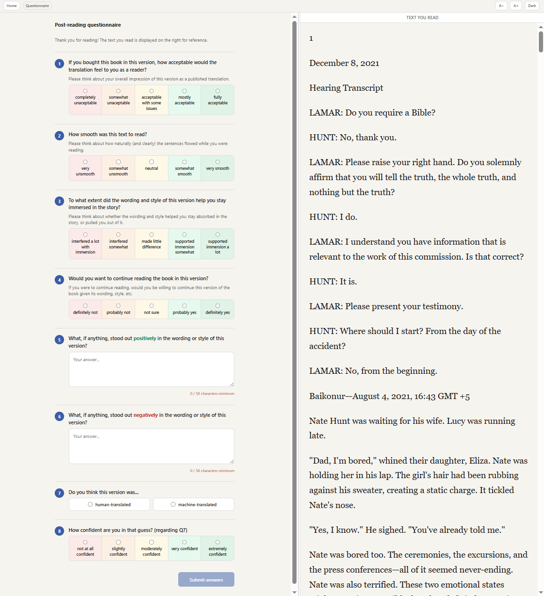
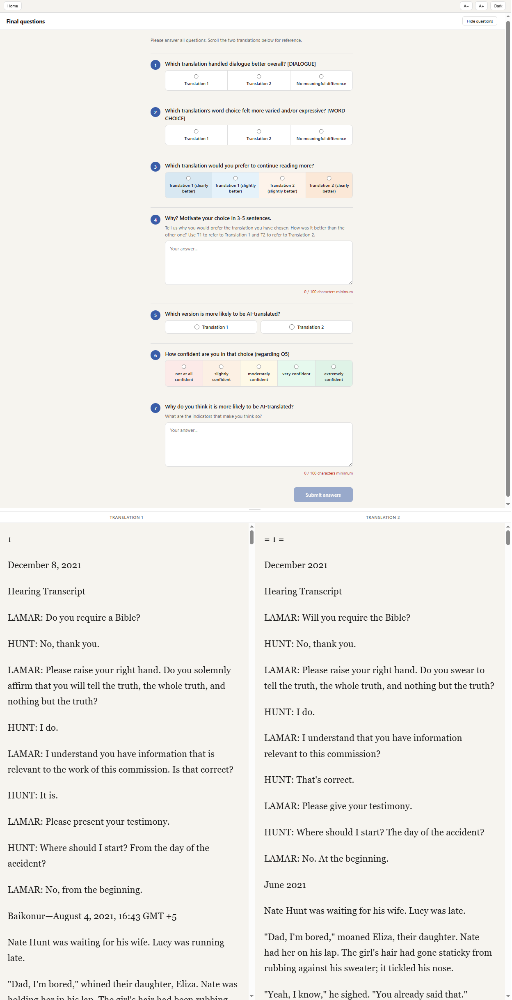
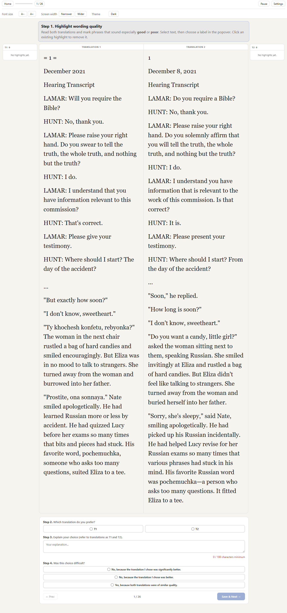

# Interface screenshots

The following screenshots demonstrate the main flow of the reading interface the participants used to evaluate excerpts and chunks.

The excerpt-level questionnaires recorded whole-excerpt long-context preferences while the chunk-level questionnaire recorded local judgements.

## Single-reading questionnaire

Single-reading questionnaire shown after an immersive reading session (full excerpt). Participants rated fluency, literary quality, immersion, willingness to continue reading, and whether the passage seemed AI-generated.

## Comparative reading questionnaire

Paired reading questionnaire shown after a comparative reading session (full excerpt). Participants chose which excerpt was translated better, was more expressive, which one they would more likely continue reading, which one they felt was the AI-translated version (MT), as well as rated confidence and explained their answers in prose.

## Chunk reading questionnaire

Paired reading questionnaire shown after a chunk reading session. The participants were asked to identify their preferred chunk and justify the decision, as well as highlight "good" and "bad" phrases.
